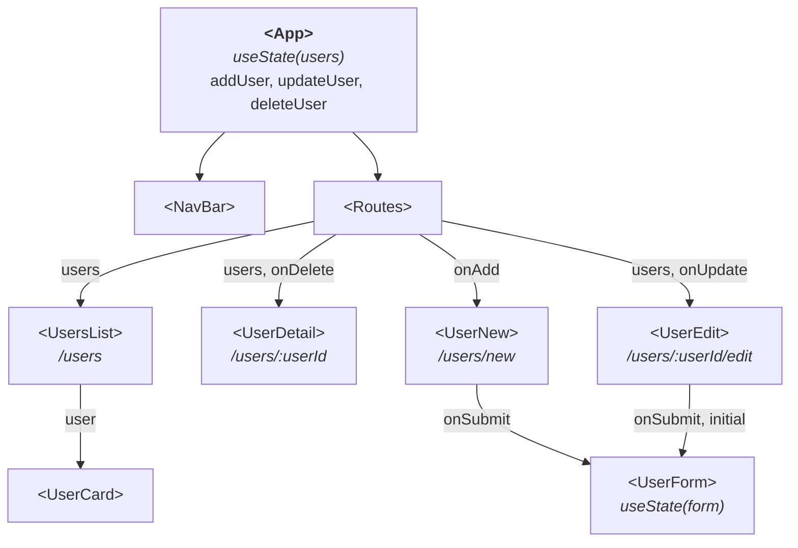
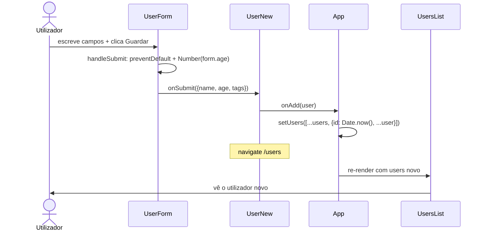

# Forms - Sessão 7

## O que muda em relação à Sessão 6

1. **`<UserForm>` controlled** (`src/components/UserForm.jsx`): um único `useState({ name, age, tags: [] })`. `name` (texto) e `age` (número) são inputs simples; `tags` é um grupo de _checkboxes_ sobre a lista fixa de `users.js` (cada _checkbox_ adiciona/remove a tag do _array_). No submit, `e.preventDefault()` e coerção do `age` para número (`tags` já é _array_).
2. **`users` passam a _state_ no `<App>`**: deixam de ser um `import` fixo. O `<App>` tem `useState(initialUsers)` e os handlers `addUser`, `updateUser`, `deleteUser`, passados por _props_ (prop drilling). É isto que faz o utilizador novo aparecer na lista.
3. **Criar em `/users/new`**: `<UserNew>` renderiza o `<UserForm>`; no submit chama `addUser` e navega para `/users`. Um `<Link>` "+ Novo utilizador" no topo da `<UsersList>`.
4. **`<UsersList>` e `<UserDetail>` recebem `users` por _prop_** (já não importam `users.js`; só o `tags` continua importado, para o filtro).
5. **(Bónus) Editar em `/users/:userId/edit`**: `<UserEdit>` lê `useParams`, encontra o utilizador e passa-o como `initial` ao `<UserForm>` (`useState(initial ?? initialForm)`); no submit chama `updateUser`. `<Link>` "Editar" no detalhe.
6. **(Bónus) Apagar**: botão "Apagar" no `<UserDetail>` chama `deleteUser(user.id)` e navega para `/users`.

## Estrutura da app

Componentes da app no estado final da sessão. \
Setas com etiqueta indicam as _props_ que cada parent passa ao child. \
`<App>` é o dona do _state_ (`users`) e dos _handlers_ que o mutam (`addUser`, `updateUser`, `deleteUser`).

## Fluxo: criar um novo utilizador

O caminho desde o clique em "Guardar" no `<UserForm>` até o utilizador aparecer na lista. \
O `<UserForm>` é o único com _state_ local, tudo o resto deriva da chamada em cadeia que sobe até ao `setUsers` no `<App>`.

