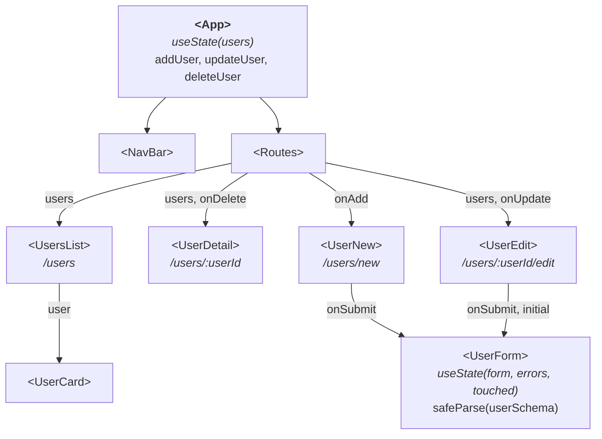
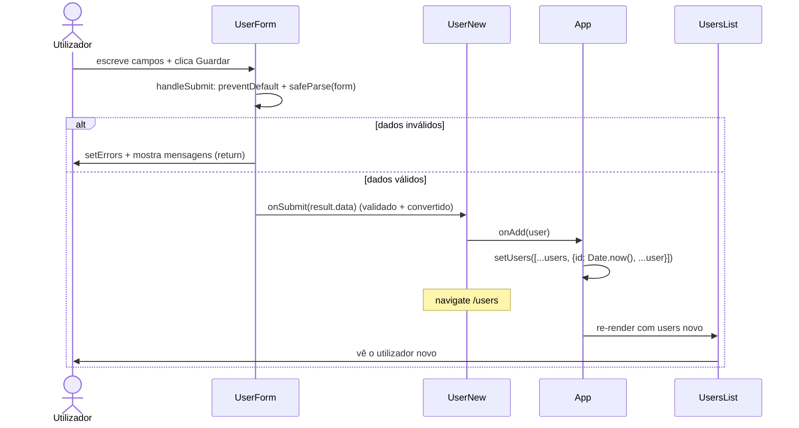

# Validação com Zod - Sessão 8

A app é a mesma da Sessão 7 (lista, detalhe, criar / editar / apagar utilizadores). O que acrescentamos é **validação com Zod** no `<UserForm>`, sem mudar a estrutura do form.

## O que muda em relação à Sessão 7

1. **`src/schemas/user.js`**: um `userSchema` (`z.object`) com a forma e as regras num só sítio: `name` obrigatório (`.min(1)`); `age` entre 18 e 120 (`z.coerce.number().int().min().max()`); `active` (`z.boolean().default(true)`, sem campo no form, logo um utilizador novo nasce ativo); `tags` (`z.array(z.string()).min(1)`, pelo menos uma selecionada). Mensagens em PT-PT via `{ error: "..." }`.
2. **`<UserForm>` valida com `safeParse`** (`src/components/UserForm.jsx`): `errors` e `touched` em _state_. No `onBlur` de cada campo marcamos `touched` e corremos `userSchema.safeParse(form)`, mapeando com `z.flattenError(result.error).fieldErrors`.
3. **Mensagens por campo**: `
{errors.x[0]}
` por baixo de `name`, `age` e `tags`, só quando `errors.x && touched.x`.
4. **`onSubmit` como _gate_**: substitui a _coercion_ manual da s7 (`Number(form.age)`). Marca tudo `touched`, corre `safeParse`, e só submete `result.data` (já validado e convertido) se passar.

O resto da app (`<App>`, páginas, `<UserCard>`, rotas) é igual à Sessão 7.

## Estrutura da app

Componentes da app no estado final da sessão. \
Setas com etiqueta indicam as _props_ que cada parent passa ao child. \
`<App>` é o dono do _state_ (`users`) e dos _handlers_ que o mutam (`addUser`, `updateUser`, `deleteUser`).

## Fluxo: criar um novo utilizador (com validação)

O caminho desde o clique em "Guardar" no `<UserForm>` até o utilizador aparecer na lista. \
Agora o `<UserForm>` valida com `safeParse` antes de submeter: só chama `onSubmit` se os dados passarem o `userSchema`.

