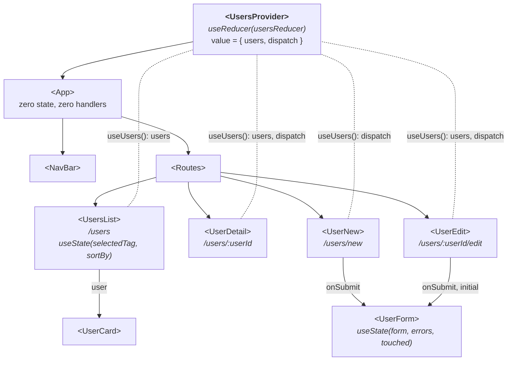

# State partilhado com Context + useReducer - Sessão 9

## O que muda em relação à Sessão 8

1. **`src/state/usersReducer.js`**: as três funções soltas de `<App>` (`addUser`, `updateUser`, `deleteUser`) passam a três `case` num _reducer_ `(state, action) => novoState`. Cada `case` devolve uma _array_ nova (spread, `map`, `filter`); o `default` faz `throw` para apanhar `type`s mal escritos. O `id` é gerado por quem faz o `dispatch`; o _reducer_ só calcula o _state_ seguinte.
2. **`src/state/UsersContext.jsx`**: `createContext(null)`; o `useReducer` é utilizado dentro do `<UsersProvider>`, que passa `{ users, dispatch }` no `value`. O _custom hook_ `useUsers()` centraliza o _check_ de `null` com mensagem de erro clara.
3. **`src/main.jsx`**: `<UsersProvider>` envolve a árvore (por fora do `<BrowserRouter>`, a mesma convenção do `<Provider>` Redux da Sessão 10).
4. **Páginas migradas**: `<UsersList>` lê de `useUsers()`; `<UserDetail>` faz `dispatch` de `deleted`; `<UserEdit>` de `updated`; `<UserNew>` de `added`, com `id: Date.now()` gerado no `dispatch`. O `selectedTag`/`sortBy` da lista ficam em `useState` local (UI local da página).
5. **`src/App.jsx`**: zero _state_, zero _handlers_, _routes_ sem _props_ de dados. Só `<NavBar />` + `<Routes>`.

O `<UserForm>` e a validação Zod da Sessão 8 não mudaram; só mudou o destino do `result.data` (de uma _prop_ `onAdd` para um `dispatch`).

## Estrutura da app

Componentes no estado final da sessão. \
Setas a cheio = composição (quem renderiza quem), com as _props_ que restam nas etiquetas. \
Linhas a tracejado, sem seta = acesso ao _state_ partilhado via `useUsers()`, sem passar por _props_. \
Compara com o diagrama da Sessão 7: as _routes_ deixaram de passar _props_ de dados; quem guarda os `users` agora é o `<UsersProvider>`.

