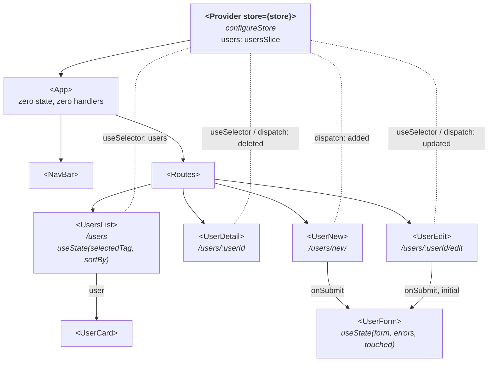

# State global com Redux Toolkit - Sessão 10

## O que muda em relação à Sessão 9

1. **`src/store/usersSlice.js`**: o `usersReducer` da Sessão 9 passa a `createSlice` (`name: "users"`, `initialState` = os utilizadores _seed_, _reducers_ `added`/`updated`/`deleted`). Dentro da _slice_ podemos "mutar" (`state.push`, atribuição por índice) **ou** devolver uma _array_ nova (`filter`), nunca os dois no mesmo _reducer_; Redux Toolkit trata da imutabilidade. Os _action creators_ (`added`/`updated`/`deleted`) são gerados a partir dos nomes dos _reducers_.
2. **`src/store/index.js`**: `configureStore({ reducer: { users: usersReducer } })`. A _key_ `users` define que o _state_ é `{ users: [...] }`, lido com `state.users`.
3. **`src/main.jsx`**: `<Provider store={store}>` (de `react-redux`) substitui o `<UsersProvider>`, no mesmo sítio (por fora do `<BrowserRouter>`).
4. **Páginas migradas**: `useUsers()` passa a `useSelector((state) => state.users)` + `useDispatch()`; `dispatch({ type: "added", user })` passa a `dispatch(added(user))` (idem `updated`/`deleted`). No `<UserEdit>`, o parâmetro do `handleSubmit` passa a chamar-se `values` para não colidir com o _action creator_ `updated`. O `selectedTag`/`sortBy` da lista ficam em `useState` local (UI local da página).
5. **Context removido**: `src/state/UsersContext.jsx` e `usersReducer.js` são apagados; o _state_ dos utilizadores vive agora na _store_ Redux.

O `<UserForm>`, a validação Zod e o `src/App.jsx` não mudaram: as _routes_ já não passavam _props_ de dados desde a Sessão 9.

## Estrutura da app

Componentes no estado final da sessão. \
Setas a cheio = composição (quem renderiza quem), com as _props_ que restam nas etiquetas. \
Linhas a tracejado, sem seta = acesso à _store_ via `useSelector`/`useDispatch`, sem passar por _props_. \
Compara com o diagrama da Sessão 9: o `<UsersProvider>` deu lugar ao `<Provider store={store}>`; quem guarda os `users` agora é a _store_ Redux.

